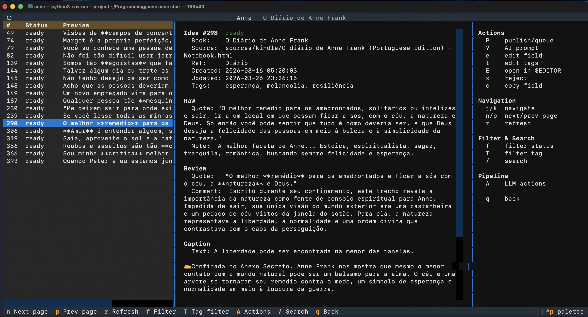

# Anne

## About

Pipeline CLI and TUI for organizing reading notes and maybe turning them into social posts,
with LLM-assisted filtering and refinement.

This is a personal tool — designed for my own workflow, but open source in case
it's useful as reference or inspiration for someone.

Its name is inspired in [Anne Frank](https://en.wikipedia.org/wiki/Anne_Frank).
Her diary is one of my favorite books, I was very touched by her story
and how she loved to read, study languages, do research and write to the world
or, in any case, just to write for herself.

## Setup

Requires Python 3.14 and [uv](https://docs.astral.sh/uv/):

```sh
uv run anne bootstrap
```

## Usage

Follow the bootstrap hint to set up a shell alias.

The examples below assume the alias is set (otherwise use `uv run anne`). Check workspace health anytime with `anne doctor`.

### Pipeline

While I read a book, **I highlight parts of the book and add personal notes with my thoughts**.
These can become what **the software calls an "idea"**.

Each idea has a lifecycle:

```
[source] → parsed → triaged → reviewed → ready → queued → published
                                               ↘ published
                  ↘ rejected (at any time, it's reversible)
```

From a source (like exported Kindle notes), the CLI parses them into the database.
Then the LLM rejects irrelevant notes during triage, adds reviewing context and translates.
At the end there's a text ready to be posted on social networks. It's possible to
flag ideas as queued or published, but there's no integration or automation of actual
publishing — it'd be too creative/personal. The flags are just visual cues for organization.

The whole point of this tool is not to create a factory of social content and clickbait,
but to use **my own reading as fuel** to an organized and consistent flow of content output.

Pipeline commands (use `--help` flag at any moment for more details):

```sh
anne books add "O Príncipe" --author "Maquiavel"   # add a book
anne sources import o-principe <file-or-url>        # import reading notes
anne ideas parse [slug]                             # extract ideas from sources
anne ideas triage [slug]                            # LLM triage (keep/reject)
anne ideas review [slug]                            # LLM review (refine quotes, add context)
anne ideas caption [slug]                           # LLM caption for Instagram
anne ideas queue 42                                 # visual flag: queued for posting
anne ideas publish 42                               # mark as published
```

### Browsing and editing

```sh
anne books list
anne ideas list o-principe --status triaged
anne ideas show 42
anne ideas edit 42 --status reviewed --force
anne ideas edit 42 --reviewed-quote "New text" --tags '["poder"]'
anne books show o-principe
anne sources list o-principe
anne ideas prompt 42 -p "suggest a shorter version" # custom LLM prompt about an idea
anne ideas curiosity -b o-principe                  # generate a curiosity phrase
```

### TUI

```sh
anne start               # dashboard with all books
anne start o-principe    # jump into a book workspace
```



### Database

For pragmatic reasons, this tool uses SQLite.
It's just designed for local usage of a single user.
And there are some simple maintenance scripts:

```sh
anne db info                     # show what's in DB vs filesystem
anne db backup                   # create timestamped backup
anne db backup-restore [path]    # restore from a backup
```

Worth mentioning,
[SQLite does not encourage usage over network](https://sqlite.org/useovernet.html),
but at the same time it feels reasonable to store SQLite and the entire Anne workspace
in a cloud-synced folder (iCloud, Google Drive, etc.), and these folders might
make the file content unavailable (iCloud might erase it locally but
download it again on demand like a user click, to spare local disk usage).
And to address that, we keep journal mode in "delete" (so SQLite deletes the journal after
using it, and reading doesn't depend on long-living files which would be just another sync risk)
a slightly increased busy timeout (so if the database is momentarily locked during sync, the app waits a little bit),
and an eviction check that triggers iCloud to re-download files before reading them.
That said, data corruption is still a risk, so run backups as you wish, especially after many
ideas went through the pipeline, to avoid having to repeat LLM-related costs.

## LLM and security

This tool sends your reading notes and book metadata to Google Gemini for parsing, triaging, reviewing, and captioning. While prompts include instructions to treat user content as raw data and ignore embedded directives, these are best-effort guardrails — LLMs can still be influenced by adversarial text. If an imported source (e.g., a blog post or article) contains hidden prompt injection (via HTML comments, invisible text, etc.), it could affect LLM outputs at any pipeline stage, and those outputs persist in your database for subsequent stages. This is a personal local-first tool and the MIT License applies — use it at your own risk, especially when importing content from sources you don't fully trust.

## License

Under [MIT License](https://github.com/Mazuh/anne/blob/main/LICENSE).

Copyright (c) 2026 Marcell "Mazuh" G. C. da Silva — [notebook.mazuh.com](https://notebook.mazuh.com)
